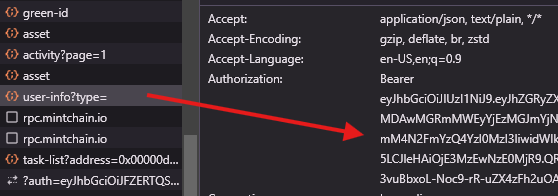

# MintChain Daily Bot

## 🔗 Links

[Mintchain Dashboard](https://www.mintchain.io/mint-forest?inviteCode=9F7D06CF)

🔔 CHANNEL: https://t.me/airdrophuntersieutoc

 ## Donate
EVM: 0xF702063F779F88c5e10Ab00e3eF184879a9CEd16

Sol address: HFq6GfGLhFiMu4i2nvPyMf3wNxqJVbueGr3FNJck9saS

Ton address:  UQA8sC7gT4omf8haqSGV6Idb4kisbWDyt0Mja4WFaTDk2i2A

## 🤖 | Features:

- **Auto registration**
- **Find and steal other trees rewards**
- **Total users**
- **Bind referral**
- **Bind twitter**
- **Collect all possible rewards (boxes, energy)**
- **Spin turntable**
- **Inject**
- **Completing tasks**
- **Bridge from ARB to MINT via CometBridge**
- **Fix sign**
- **Export Trees IDs**
- **Mint the following NFTs:**
    
    - Green ID
    - Commemorative NFT
    - Make NFT Great Again
    - Flag NFT
    - Shop NFT
    - Air3 NFT
    - SuperMint NFT
    - Owlto SummerFest NFT
    - Omnihub SummerFest NFT
    - Vip3 NFT
    - Summer NFT

## 🚀 Installation
`` Required python >= 3.10``

``1. Clone the repo and open CMD (console) inside it``

``2. Install requirements: pip install -r requirements.txt``

``3. Setup configuration and accounts``

``4. Run: python run.py``

## ⚙️ Config (config > settings.yaml)

| Name                                   | Description                                                                                                                                                |
|----------------------------------------|------------------------------------------------------------------------------------------------------------------------------------------------------------|
| referral_code                          | Your referral code                                                                                                                                         |
| mint_rpc_url                           | MINT RPC URL (if not have, leave the default value)                                                                                                        |
| arb_rpc_url                            | ARB RPC URL (if not have, leave the default value)                                                                                                         |
| threads                                | Number of accounts that will work simultaneously                                                                                                           |
| min_delay_before_start                 | min delay before start accounts actions (in seconds)                                                                                                       |
| max_delay_before_start                 | max delay before start accounts actions (in seconds)                                                                                                       |
| spin_turntable_by_percentage_of_energy | percentage of balance that will be spent on spins (for example, if you have 500 energy daily and you bet 60%, the script will make 1 spin on your account) |
| shuffle_accounts                       | shuffle accounts before start                                                                                                                              |
| mint_random_all_nfts                  | mint random NFTs in list                                                                                                                                   |
delay_between_mint_min                  | min delay between mint NFTs (in seconds)                                                                                                                   |
| delay_between_mint_max                  | max delay between mint NFTs (in seconds)                                                                                                                   |
| comet_bridge_wallet                    | main wallet (pr or mnemonic) for bridge from ARB to MINT multi wallets                                                                                     |
| comet_bridge_amount_min               | min amount for bridge from ARB to MINT                                                                                                                     |
| comet_bridge_amount_max               | max amount for bridge from ARB to MINT                                                                                                                     |
| find_and_steal_percentage_range_start               | start of the percentage range of trees to search for rewards                                                                                                                   |
| find_and_steal_percentage_range_end               | end of the percentage range of trees to search for rewards                                                                                                                |
| find_and_steal_min_amount               | min amount find and steal                                                                                                                |

## ⚙️ Accounts format (config > accounts.txt)

- twitter_auth_token|wallet_mnemonic_or_privatekey|proxy   or access_token|wallet_mnemonic_or_privatekey|proxy

## How to get access token
- First login to [Mintchain Dashboard](https://www.mintchain.io/mint-forest?inviteCode=9F7D06CF)
- Press F12 to open console
- find and click Network 
- Last find user-info and copy your `Authorization`, copy from `eyjhb......`

`` Proxy format: IP:PORT:USER:PASS``
